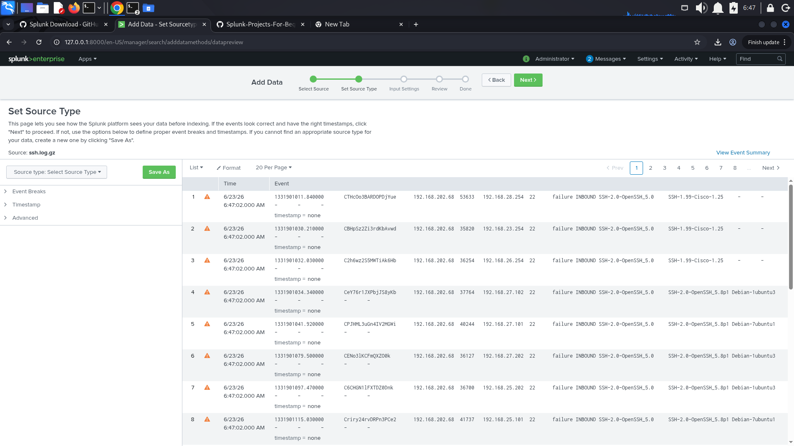
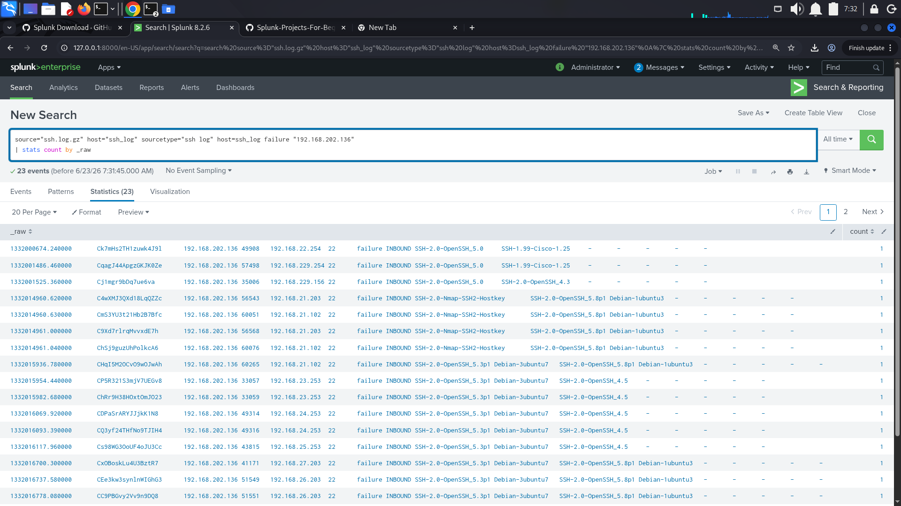
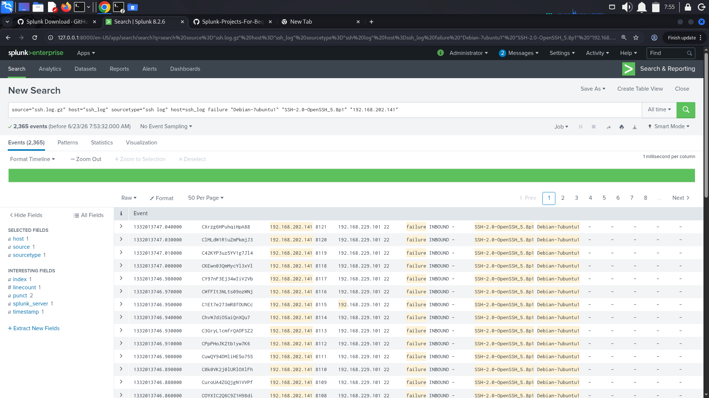
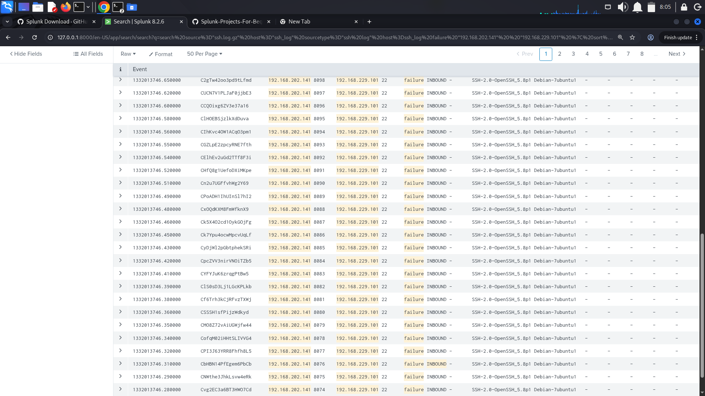
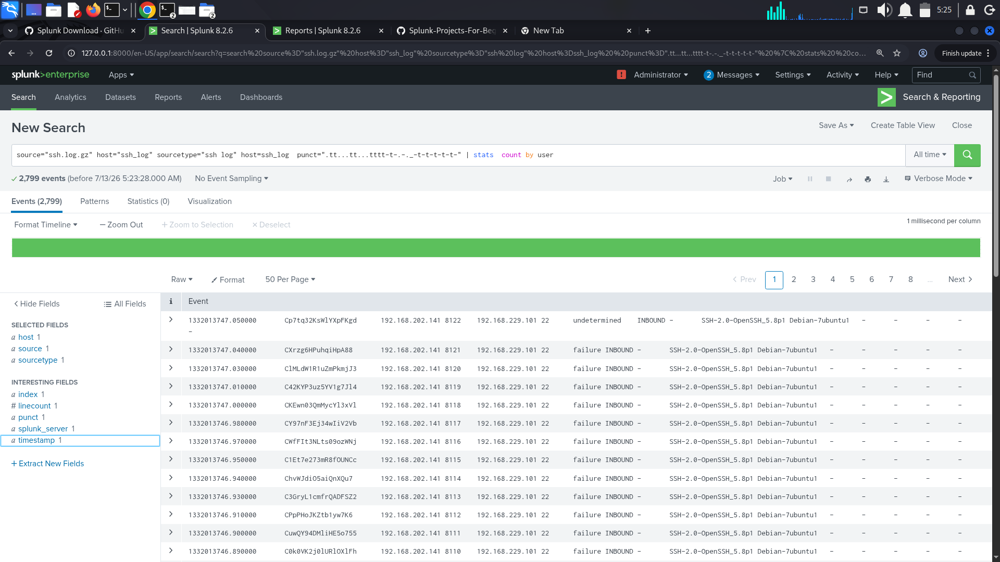
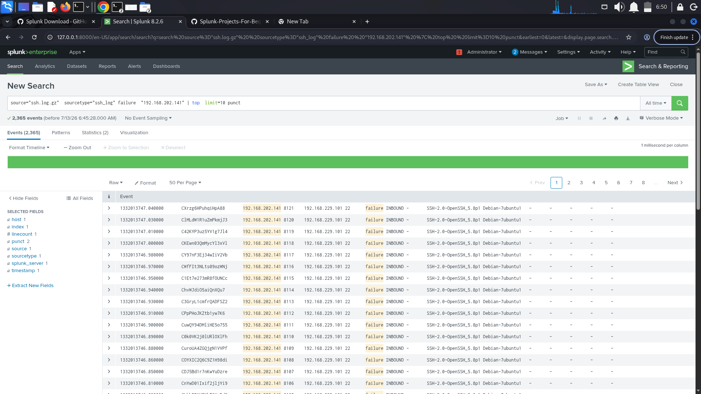

# SSH Log Analysis using Splunk SIEM

Analysis of SSH authentication logs using Splunk SIEM to detect brute-force
login attempts and unauthorized access patterns.

## Objective

SSH logs record every remote access attempt to a server — who tried to log
in, from where, and whether it succeeded. Attackers frequently target SSH
(port 22) with automated brute-force tools, making SSH log analysis a core
SOC monitoring task. This project ingests a sample SSH log dataset into
Splunk and investigates it for signs of unauthorized or automated access
attempts.

## Tools Used

- Splunk Enterprise 8.2.6
- Sample SSH log dataset (`ssh.log.gz`)

## Steps Performed

### 1. Selecting the source file
Started the Add Data workflow in Splunk and selected the sample `ssh.log.gz`
file for upload.


### 2. Splunk home / environment setup
Confirmed the Splunk Enterprise instance was running and accessible before
beginning ingestion.


### 3. Choosing the data input method
Selected **Upload** as the method to bring the SSH log file into Splunk
(as opposed to monitoring a live file path or forwarding from an agent).


### 4. Setting the source type
Reviewed how Splunk parsed the uploaded events and confirmed the source
type before indexing. At this stage the raw events were already visible,
showing fields like source IP, destination IP, port, and connection result
(`failure` / `INBOUND`).



### 5. Verifying ingestion and counting raw events
Ran an initial search against the indexed data and grouped events by
`_raw` to confirm the logs were searchable and to get a first look at
volume from a specific host.

```spl
source="ssh.log.gz" host="ssh_log" sourcetype="ssh_log" host=ssh_log failure "192.168.202.136"
| stats count by _raw
```



### 6. Filtering failed logins by client signature and source IP
Narrowed the search to failed connections from a specific client signature
(`SSH-2.0-OpenSSH_5.8p1`, Debian) and source IP. This query returned
**2,365 matching events**.

```spl
source="ssh.log.gz" host="ssh_log" sourcetype="ssh_log" host=ssh_log failure "Debian-7ubuntu1" "SSH-2.0-OpenSSH_5.8p1" "192.168.202.141"
```



### 7. Inspecting individual event detail
Drilled into the raw event listing to inspect individual failed login
attempts — timestamps, session IDs, source/destination IPs and ports.



### 8. Grouping by user
Used Splunk's `punct` field (which captures the punctuation/structural
pattern of a log line) to isolate a consistent event format, then
aggregated by user to see which accounts were being targeted.

```spl
source="ssh.log.gz" host="ssh_log" sourcetype="ssh_log" host=ssh_log punct="..tt...tt...tttt-t-.-._-t-t-t-t-t-"
| stats count by user
```



### 9. Identifying the dominant attack pattern
Used `top` on the `punct` field to surface the most common log-line
pattern among failed logins from `192.168.202.141`, confirming a
repeated, near-identical event signature consistent with an automated
brute-force attempt.

```spl
source="ssh.log.gz" sourcetype="ssh_log" failure "192.168.202.141" | top limit=10 punct
```



## Key Findings

- **192.168.202.141** generated **2,365 failed SSH login attempts** against
  `192.168.229.101:22`, all using the same client signature
  (`SSH-2.0-OpenSSH_5.8p1`, Debian-7ubuntu1).
- Timestamps between failed attempts were only milliseconds apart —
  far too fast for manual typing, indicating an automated brute-force
  tool rather than a genuine user mistyping credentials.
- A second source IP, **192.168.202.136**, was also observed generating
  failed connections across multiple destination hosts, suggesting
  broader scanning activity across the subnet rather than a single
  targeted attack.
- Grouping by `user` and by `punct` pattern proved useful for separating
  normal authentication noise from a clear, repeatable attack signature —
  a technique that generalizes well to other log types beyond SSH.

## What I Learned

- How to ingest and parse raw log files in Splunk using the Upload method.
- How to use SPL (`stats`, `top`, `punct`) to move from raw log noise to a
  clear security finding.
- How field extraction and pattern analysis (via `punct`) can quickly
  surface automated/attack behavior in large volumes of authentication
  logs.
- The importance of correlating source IP, client signature, and timing
  together rather than relying on any single field in isolation.

## Files

- [`spl-queries.txt`](spl-queries.txt) — all SPL queries used, with
  explanations.
